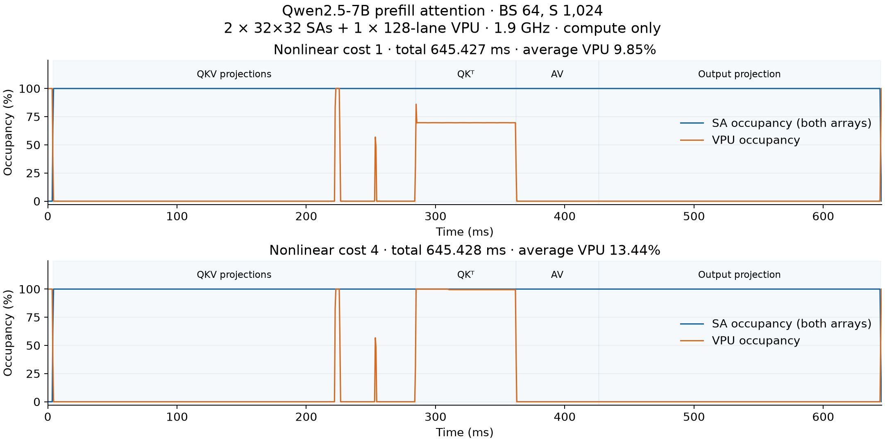

# Qwen2.5-7B attention: two 32×32 SAs and one 128-lane VPU

Prefill, batch **64**, sequence **1,024**, **65,536 tokens**, one self-attention sublayer. This includes input RMSNorm and the output residual add; the MLP is excluded.

**Compute only:** original COCOSSim SA/VPU state machines with immediate memory completion, a custom operator DAG, and FIFO scheduling. There are no memory, network, or other compute resources. This predicts timing without executing numerical tensors or validating a particular chip.

Peak provisioning is **2,048 MACs/cycle : 128 simple vector ops/cycle = 16:1**. One MAC is counted once. SAs issue one MAC per cell per cycle; the VPU issues one ordinary op per lane per cycle. The clock assumption is 1.9 GHz.

## Result

| Nonlinear lane-cycle cost | Cycles | Sublayer latency (ms) | SA occupied | SA useful MAC utilization | VPU occupied |
|---:|---:|---:|---:|---:|---:|
| 1 | 1,226,311,168 | 645.426931 | 99.25% | 95.77% | 9.85% |
| 4 | 1,226,312,704 | 645.427739 | 99.25% | 95.77% | 13.44% |

Nonlinear cost assigns exp, reciprocal, and rsqrt either one or four lane-cycle equivalents. This is a throughput sensitivity assumption, not a measured SFU instruction latency.

The central QK → softmax → AV interval takes **141.549 ms**. QKV and output projections account for most of the remaining time.

## How the layer maps

The input is [64, 1024, 3584], flattened to [65536, 3584] for projections. There are 28 query heads, four K/V heads, and 128 elements per head. Seven query heads share each K/V head.

| Operation | Resource | Matrix shape or vector work |
|---|---|---|
| Input RMSNorm | VPU | One normalization over 3584 values per token |
| Q projection | Both SAs | [65536,3584] × [3584,3584] |
| K and V projections | Both SAs | Each [65536,3584] × [3584,512] |
| Bias and RoPE | VPU | Bias on Q/K/V; cached-table rotary arithmetic on Q/K |
| QKᵀ | Both SAs | Per sequence/query head: [1024,128] × [128,1024] |
| Scale, mask, stable softmax | VPU | Max and sum reductions, exp, reciprocal, normalization |
| AV | Both SAs | Per sequence/query head: [1024,1024] × [1024,128] |
| Output projection | Both SAs | [65536,3584] × [3584,3584] |
| Residual add | VPU | One add per output element |

Every GEMM is split into output tiles of at most 32×32 with full K accumulation. The two SAs execute two independent tiles at once. Attention has independent groups of up to 128 query rows. The VPU reduces each row serially, with up to 128 independent rows in parallel.

## Scheduled timeline

Times below describe category execution windows. Vector windows include gaps and can overlap SA windows.

| Operation | Starts (ms) | Ends (ms) | Active service / available units (ms) |
|---|---:|---:|---:|
| RMSNorm | 0.000 | 3.865 | 3.865 |
| QKV | 3.865 | 284.575 | 280.710 |
| QKV_bias | 222.195 | 284.714 | 1.251 |
| RoPE | 223.168 | 253.939 | 3.320 |
| Attention_QK | 284.575 | 362.321 | 77.746 |
| Softmax | 284.714 | 362.325 | 54.137 |
| Attention_AV | 362.321 | 426.124 | 63.803 |
| O_projection | 426.124 | 644.454 | 218.330 |
| Residual | 644.454 | 645.427 | 0.973 |

The FIFO queues dispatch Q, K, then V projections. Bias and rotary work overlap later projections. All QK groups enter the SA queue before AV jobs become ready, so SAs complete the QK groups, then the AV groups. Softmax overlaps QK execution. This is the modeled scheduling policy; a scheduler that prioritizes ready AV groups would produce a different timeline.

The plot averages occupancy over 1,000,000-cycle bins (about 0.526 ms at 1.9 GHz).

## One attention group

For the first group (128 query rows, one query head, one sequence):

| Operation | Jobs | Service cycles with these resources | Time (µs) |
|---|---:|---:|---:|
| QKᵀ | 128 SA tiles | 10,304 | 5.423 |
| Softmax, nonlinear cost 1 | 1 VPU group | 7,175 | 3.776 |
| Softmax, nonlinear cost 4 | 1 VPU group | 10,250 | 5.395 |
| AV | 16 SA tiles | 8,456 | 4.451 |

These are service times without queue waiting. A group depends on its own QK → softmax → AV chain; other groups can overlap it. For S=1024, the two SAs produce a group of scores every 10,304 cycles. Softmax consumes 7,175 cycles at nonlinear cost 1 or 10,250 at cost 4: about 69.6% or 99.5% of that production interval. **Low average VPU occupancy does not imply generous headroom during softmax.**

## Boundaries and validation

- Dense masked causal attention: both GEMMs execute the full square, including the masked upper triangle. No FlashAttention or causal tile skipping.
- Cached RoPE tables; no table generation, data movement, packing, or dtype conversion cost.
- Projection boundaries wait for the whole projection. Attention dependencies are per 128-row group. SRAM capacity is unconstrained because memory is excluded.
- Native tile service, clock isolation, exact tail work, attention scope, and a two-SA/one-VPU dependency chain are checked. Fifty deterministic random DAGs compare event and cycle stepping.
- Every run checks work/service conservation, resource capacity, and producer completion. This report independently audits all per-stage dependencies and analytical attention MAC/vector totals.
- Total work: 2,405,181,685,760 MACs; 15,437,070,336 vector equivalents for nonlinear cost 1.

## Timing correction

The earlier sweep initialized a native SA before resetting the oracle clock. Native SA initialization captures the dispatch timestamp, so shorter following measurements could acquire an artificial completion stall. The reset now happens before initialization. At 32×32 output, K=128 takes 161 cycles and K=1024 takes 1057 cycles; the old sweep recorded 385 and 2049. This report uses corrected timings. The prior full-layer sweep was also rerun.

## Sources

- [Qwen configuration](https://huggingface.co/Qwen/Qwen2.5-7B-Instruct/blob/main/config.json)
- [Reference attention implementation](https://github.com/huggingface/transformers/blob/v4.43.4/src/transformers/models/qwen2/modeling_qwen2.py)
